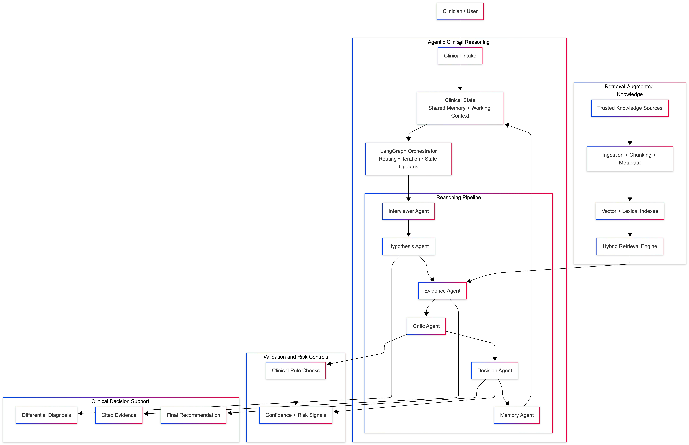

# Multi-Agent Clinical Decision Support System

This repository is a clinical decision support prototype built around a LangGraph workflow. A Next.js frontend collects symptoms, a FastAPI backend orchestrates specialized agents, the evidence step grounds reasoning with local RAG, and completed visits are stored in SQLite for patient-specific history.

## What The System Does

The runtime is split into two product phases:

1. `POST /api/interview` generates follow-up questions from the initial symptom list and recent patient history.
2. `POST /api/diagnose` runs the full LangGraph workflow and streams progress back to the UI with Server-Sent Events.

The graph executes these roles:

- `InterviewerAgent`: synthesizes the intake into a structured symptom profile
- `HypothesisAgent`: generates or refines ranked differential diagnoses
- `EvidenceAgent`: retrieves supporting chunks and converts them into evidence analysis
- `CriticAgent`: scores the quality of the reasoning and can trigger another pass
- `DecisionAgent`: produces the final ranked diagnoses, summary, and caveats
- `MemoryAgent`: stores the visit and reloads patient history

The critic score is inverted from the usual meaning: a higher score means worse reasoning. If the score is greater than or equal to the threshold and there are iterations left, the graph loops back to `hypothesis`.

## Architecture



## Repository Layout

```text
agents/       agent implementations and shared BaseAgent utilities
api/          FastAPI app, routes, and Pydantic models
graph/        ClinicalState definition and LangGraph workflow assembly
rag/          ingestion, embeddings, FAISS loading, hybrid retrieval
memory/       SQLite persistence layer
frontend/     Next.js application and streaming UI
data/         source corpus, FAISS artifacts, sample cases, SQLite database
tests/        smoke tests for config, graph, RAG, memory, and API wiring
eval/         sample-case evaluation runner
```

## Quick Start

### Prerequisites

- Python 3.13 is what the repo is currently set up around
- Node.js 20+ is recommended
- an OpenAI API key for interview, diagnosis, and evaluation runs

### One-command setup

```bash
chmod +x setup.sh
./setup.sh
```

The setup script:

- activates the local `mac_env` virtual environment
- installs Python dependencies
- installs frontend dependencies
- creates `.env` from `.env.example` if needed
- builds the FAISS index
- runs the smoke test suite

### Manual setup with existing `mac_env`

```bash
source mac_env/bin/activate
pip install -r requirements.txt

cp .env.example .env
# edit .env and set OPENAI_API_KEY

python -m rag.ingest

cd frontend
npm install
cd ..
```

### From-scratch setup on a new machine

Use this path if `mac_env/` does not already exist or you want to recreate the environment cleanly.

```bash
# create and activate a virtual environment
python3 -m venv mac_env
source mac_env/bin/activate

# upgrade packaging tools
python -m pip install --upgrade pip setuptools wheel

# install backend dependencies
pip install -r requirements.txt

# create local environment config
cp .env.example .env
# edit .env and set OPENAI_API_KEY

# install frontend dependencies
cd frontend
npm install
cd ..

# build the FAISS index and source manifest
python -m rag.ingest

# run smoke tests
python tests/smoke_test.py
```

If you are on a machine without the embedding model cached locally and `EMBEDDINGS_LOCAL_ONLY=true`, the ingest step may fail. In that case either:

- temporarily set `EMBEDDINGS_LOCAL_ONLY=false` and rerun `python -m rag.ingest`
- or pre-populate the local model cache before rebuilding

### Run the app

Backend:

```bash
source mac_env/bin/activate
uvicorn api.main:app --reload --port 8000
```

Frontend:

```bash
cd frontend
npm run dev
```

Open:

- `http://localhost:3000/` for the landing page
- `http://localhost:3000/assessment` for the live workspace

## Verification Commands

```bash
# backend health
curl http://localhost:8000/api/health

# root endpoint with endpoint map
curl http://localhost:8000/

# smoke tests
source mac_env/bin/activate
python tests/smoke_test.py

# sample-case evaluation
python -m eval.evaluate
```

The smoke tests verify config, source availability, FAISS status, retriever behavior, SQLite memory, graph compilation, and API route registration.

## API Surface

### `POST /api/interview`

Input:

```json
{
  "patient_id": "patient_001",
  "symptoms": ["fever", "cough", "shortness of breath"]
}
```

Returns follow-up questions, extracted symptoms, and a symptom summary.

### `POST /api/diagnose`

Input:

```json
{
  "patient_id": "patient_001",
  "symptoms": ["fever", "cough"],
  "critic_enabled": true,
  "max_iterations": 3,
  "critic_threshold": 0.7,
  "interview_answers": []
}
```

Returns an SSE stream with these event types:

- `start`
- `agent_update`
- `state_update`
- `error`
- `complete`

### `POST /api/diagnose/compare`

Runs the workflow twice, once with critic enabled and once disabled, and returns both final results as JSON. This route is a batch comparison helper, not a streaming endpoint.

### `GET /api/memory/{patient_id}`

Returns the stored visit history and total visit count for one patient.

### `GET /api/health`

Returns readiness information for:

- database initialization
- LLM configuration presence
- RAG availability
- index manifest status and staleness
- active request id header

## Configuration

The main settings live in `.env`.

Key variables:

- `OPENAI_API_KEY`: required for the LLM-backed workflow
- `LLM_MODEL`, `LLM_TEMPERATURE`
- `API_PORT`, `FRONTEND_URLS`, `REQUEST_ID_HEADER`
- `EMBEDDING_MODEL`, `EMBEDDINGS_LOCAL_ONLY`
- `RETRIEVER_K`, `HYBRID_RETRIEVER_K`, `HYBRID_RRF_K`
- `LEXICAL_WEIGHT`, `DENSE_WEIGHT`
- `RERANK_TOP_N`, `RERANKER_MODEL`, `RERANKER_LOCAL_ONLY`
- `DEFAULT_MAX_ITERATIONS`, `DEFAULT_CRITIC_THRESHOLD`
- `MAX_EVIDENCE_DOCS`
- `DATA_DIR`, `DB_PATH`, `SOURCE_DOCS_DIR`, `PDF_SOURCES_DIR`, `TEXT_SOURCES_DIR`
- `ENABLE_JSON_KNOWLEDGE`, `AUTO_REBUILD_STALE_INDEX`
- `LOG_LEVEL`, `LOG_DIR`, `LOG_MAX_BYTES`, `LOG_BACKUP_COUNT`

Important RAG note:

- if `EMBEDDINGS_LOCAL_ONLY=true`, the embedding model must already exist in the local cache
- if you want the machine to download the model, temporarily set `EMBEDDINGS_LOCAL_ONLY=false`

## RAG Sources And Ingestion

The retriever can build its corpus from:

- `data/source_docs/pdfs/*.pdf`
- `data/source_docs/text/*.txt`
- `data/source_docs/text/*.md`
- `data/medical_knowledge.json` when `ENABLE_JSON_KNOWLEDGE=true`

During ingestion, the system:

1. loads enabled JSON, PDF, and text sources
2. normalizes text
3. splits content into chunks with metadata
4. writes the FAISS index to `data/faiss_index/`
5. writes a source signature manifest to `data/faiss_index_manifest.json`

By default, JSON knowledge is enabled, so the local structured source is included unless you explicitly set `ENABLE_JSON_KNOWLEDGE=false`.

Rebuild after changing sources:

```bash
source mac_env/bin/activate
python -m rag.ingest
```

## Updating The RAG Corpus

When you add or change source material, use this workflow.

### If you add a new document

1. Put the file in the correct source folder:
   - PDFs go in `data/source_docs/pdfs/`
   - Markdown or text files go in `data/source_docs/text/`
2. Decide whether `data/medical_knowledge.json` should also be included.
   - Keep `ENABLE_JSON_KNOWLEDGE=true` to include it
   - Set `ENABLE_JSON_KNOWLEDGE=false` to use only document sources
3. Rebuild the FAISS index and manifest:

```bash
source mac_env/bin/activate
python -m rag.ingest
```

4. Verify the backend sees the rebuilt index:

```bash
curl http://localhost:8000/api/health
```

Check:

- `index_status.exists` is `true`
- `index_status.stale` is `false`
- `index_status.document_count` increased as expected

5. Run the smoke test again:

```bash
mac_env/bin/python tests/smoke_test.py
```

### If you remove or replace a document

Use the same rebuild flow. The manifest is signature-based, so any source change should be followed by a fresh `python -m rag.ingest`.

### If ingestion fails

Common causes:

- the embedding model is not available locally while `EMBEDDINGS_LOCAL_ONLY=true`
- the PDF text extractor cannot read a file cleanly
- the source file was added to `pdf_backup/` instead of `pdfs/`

If the embedding model is missing, either:

- temporarily set `EMBEDDINGS_LOCAL_ONLY=false` on a machine with network access and rebuild once
- or place the embedding model in the configured cache directory first

### Good operational habits

- rebuild RAG after every corpus change, not just after large changes
- keep source files in `pdfs/` and `text/`, not only in backup folders
- use trusted medical references because retrieval quality depends directly on source quality
- check `logs/clinical_system.log` if health checks say the index is stale or unavailable
- rerun `python -m eval.evaluate` after major corpus changes if you want to compare behavior on the sample cases

The runtime retriever is hybrid:

- dense retrieval from FAISS
- lexical retrieval from an in-memory BM25-style index
- reciprocal-rank fusion
- optional cross-encoder reranking when `RERANKER_MODEL` is configured

## Logging

Structured logs are written to `logs/clinical_system.log` and include:

- timestamp
- log level
- component name
- agent name
- workflow step label
- request id when available

Useful commands:

```bash
tail -f logs/clinical_system.log
```

## Safety And Scope

This project is a workflow and systems prototype, not a medically validated diagnostic product. It is useful for demonstrating:

- agent orchestration with LangGraph
- streamed stateful reasoning
- retrieval-grounded evidence analysis
- persistent patient context across runs

It should not be represented as a substitute for clinician judgment or as a compliant production healthcare deployment.
- `index_status.stale`
- `log_file`

If something fails:

1. inspect `logs/clinical_system.log`
2. verify `data/faiss_index/` and `data/faiss_index_manifest.json`
3. rebuild the index with `python -m rag.ingest`
4. restart the backend

## Project Structure

```
├── config.py            # Centralized configuration (env vars)
├── agents/              # 6 AI agents
│   ├── base.py          # Base class with LLM, logging, JSON parsing
│   ├── interviewer.py   # Symptom collection + follow-up questions
│   ├── hypothesis.py    # Differential diagnosis generation
│   ├── evidence.py      # RAG-powered evidence retrieval
│   ├── critic.py        # Reasoning quality evaluation
│   ├── decision.py      # Final diagnosis with confidence
│   └── memory_agent.py  # Patient history persistence
├── graph/               # LangGraph workflow
│   ├── state.py         # ClinicalState TypedDict with reducers
│   └── workflow.py      # Graph assembly and conditional edges
├── rag/                 # RAG pipeline
│   ├── embeddings.py    # Sentence transformer embeddings
│   ├── vectorstore.py   # FAISS index management
│   └── ingest.py        # Medical knowledge chunking + indexing
├── memory/              # Persistence
│   └── long_term.py     # SQLite async patient memory
├── api/                 # FastAPI backend
│   ├── main.py          # App entry point, CORS, lifespan
│   ├── routes.py        # SSE streaming + REST endpoints
│   └── models.py        # Pydantic request/response schemas
├── frontend/            # Next.js React app
│   ├── hooks/           # useDiagnosis SSE hook
│   └── components/      # All UI components
├── data/                # Medical knowledge, sample cases, FAISS index, SQLite DB
├── eval/                # Evaluation script (10 cases)
├── tests/               # Smoke tests
├── logs/                # Persistent log files
├── utils/               # Logging utilities
├── requirements.txt
├── setup.sh
└── .env.example
```

## Troubleshooting

### Embedding model fails to load

- Ensure `mac_env` is active
- If you are offline, keep `EMBEDDINGS_LOCAL_ONLY=true`
- If the model is not cached locally yet, temporarily set `EMBEDDINGS_LOCAL_ONLY=false` on a networked machine and rebuild once

### FAISS index is missing or stale

- Run `python -m rag.ingest`
- Restart the backend
- Check `/api/health` for `index_status`

### Backend starts but retrieval is unavailable

- Tail `logs/clinical_system.log`
- Confirm the embedding model is cached locally
- Confirm `data/faiss_index/` exists and the manifest is present

### History total looks wrong

- The UI now shows the true total count, not just the last 20 loaded visits
- If it still looks off, inspect the database logs for `get_visit_count`

## Known Limitations

1. **Not a medical device.** This is an AI-assisted tool for clinical decision support. It does not replace professional medical judgment. Always correlate with clinical findings, tests, and patient history.

2. **LLM accuracy.** Diagnosis quality depends on the underlying LLM. Confidence scores and critic scores are useful relative signals, not clinically calibrated probabilities.

3. **Corpus governance matters.** Production deployment should use only trusted sources (books, guidelines, vetted references) and should remove synthetic or non-authoritative sources from the active retrieval corpus.

4. **No drug interaction checking.** The system does not check for contraindications, drug interactions, or full patient-specific risk factors.

5. **Single-turn interview.** The patient interview is still a single guided follow-up round rather than a full multi-turn clinical intake.

6. **No authentication.** The API has no authentication or rate limiting. Production deployment requires proper security.

7. **Critic score dampening.** The critic's score is dampened on later iterations to prevent infinite loops. This is a pragmatic heuristic, not a clinically validated quality measure.

8. **Offline model assumptions.** The current setup prefers local model caches for embeddings and reranking. First-time deployments need a controlled model bootstrap/download step.

## Sample Cases

10 synthetic patient cases covering: Pulmonary Embolism, Pneumonia, Hypothyroidism, Type 1 Diabetes, Meningitis, Appendicitis, Major Depression, Asthma, Iron Deficiency Anemia, and Congestive Heart Failure.
